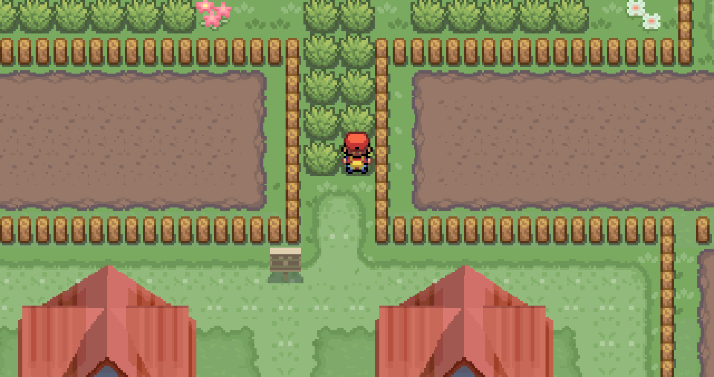
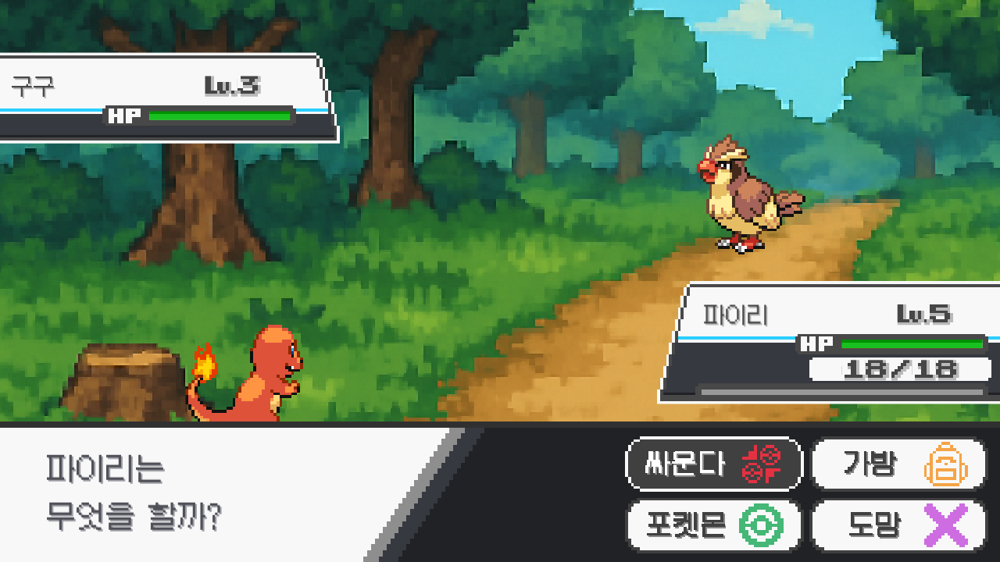
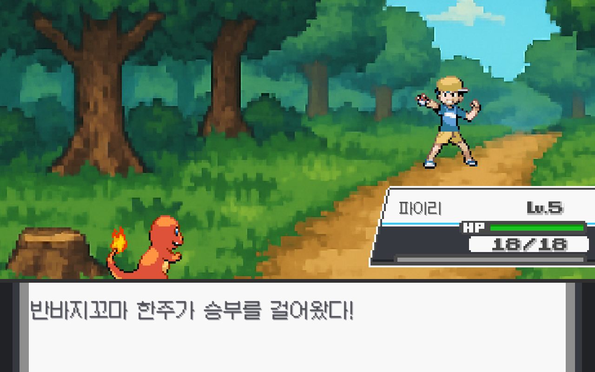
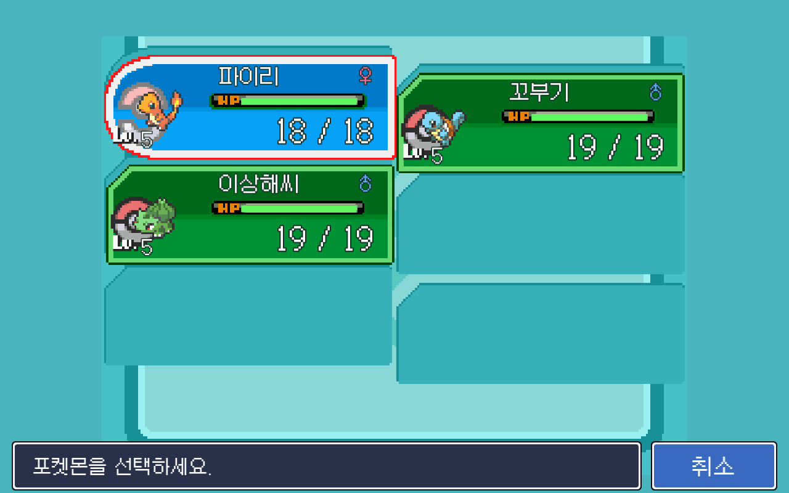
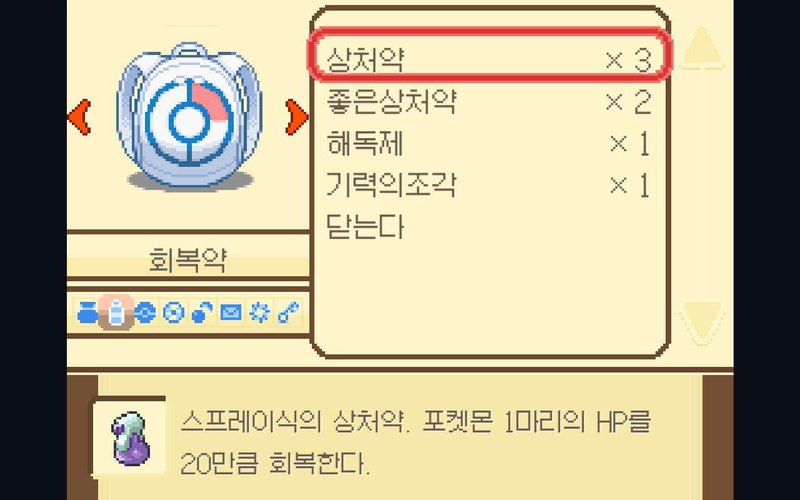
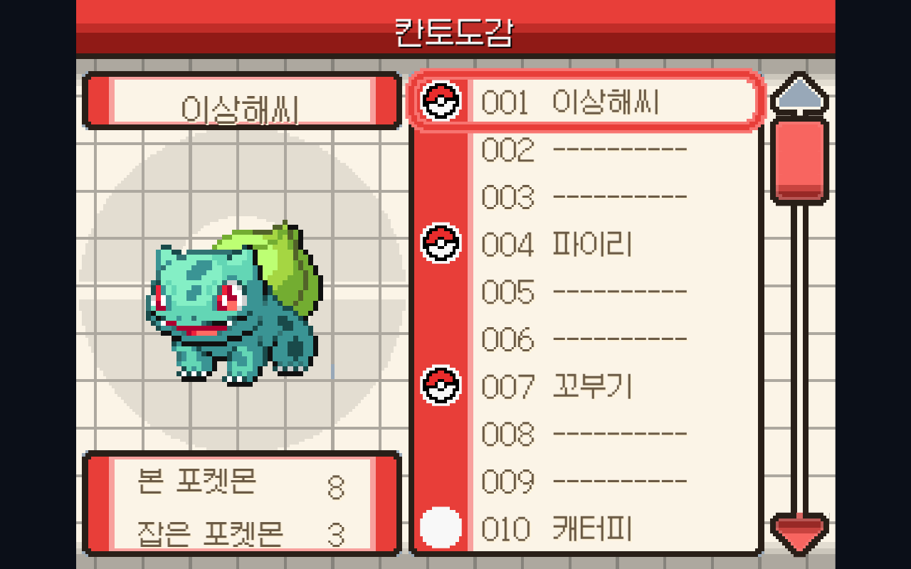

<div align="center">


**Phaser 3 + TypeScript로 처음부터 만든 2D 그리드 RPG 엔진**
그리고 상용 RPG의 바이너리 게임 데이터를 직접 해석해 콘텐츠로 옮기는 추출 파이프라인


**개인 프로젝트** · 2026.06 ~ 진행 중 · 기획/개발/에셋 파이프라인 전부 단독

</div>

---

## 한 줄 소개

게임 엔진(Unity·RPG Maker) 없이 **Phaser 3 + TypeScript만으로 2D 타일 RPG를 밑바닥부터** 만들고 있습니다.
핵심은 게임 자체보다 **"기존 게임의 데이터를 어떻게 신뢰할 수 있는 형태로 가져오고, 재현했다는 걸 어떻게 증명하느냐"** 입니다.
그래서 이 저장소에는 게임 코드뿐 아니라 **Ruby Marshal 바이너리 파서, 맵 렌더러, 픽셀 단위 대조 검증 도구**가 함께 들어 있습니다.

> 화풍·전투 규칙의 레퍼런스는 RPG Maker XP 기반 팬게임 *Another Red*(이하 AR)이며,
> **좌표·수식·데이터를 눈대중이 아니라 원본 파일에서 추출해 이식**하는 것을 원칙으로 삼았습니다.

---

## 이 프로젝트에서 봐주셨으면 하는 것

| | |
|---|---|
| **바이너리 리버스 엔지니어링** | RPG Maker XP의 `.rxdata`(Ruby Marshal) / `.dat`를 `rubymarshal`로 직접 파싱. 맵 데이터는 Marshal이 못 푸는 `Table` 구조라 **바이트 레이아웃을 직접 뜯어 언팩** (`struct.unpack('<5i', raw[:20])` → int16 타일 ID) |
| **"지어내지 않는다"는 원칙을 도구로 강제** | UI 좌표를 감으로 그리지 않고 원본 Ruby 스크립트(`Scripts.rxdata` → zlib)에서 추출. 지키는지를 **git hook으로 차단**(아래 트러블슈팅 3) |
| **검증을 눈대중에서 수치로** | Playwright로 실게임을 캡처 → PIL로 원본과 1:1 블렌드/픽셀 diff. "비슷해 보인다"가 아니라 **"464픽셀 중 불일치 0"** |
| **순수 함수로 분리된 로직 코어** | 전투·포획·인카운터·경험치를 Phaser 의존성 없는 `systems/`로 분리, 난수를 주입(`rnd`) 가능하게 해 **결정론적 재현·통계 검증** |

---

## 주요 기능

- **오버월드** — 32px 격자 이동. 맵 3장(상록시티/1번도로/태초마을)을 **52×100 단일 격자**로 이어 붙여 심리스 이동. 충돌·풀숲 배열은 손으로 안 짜고 **원본 terrain tag에서 스크립트로 생성**
- **야생 조우** — 원본의 걸음 판정을 그대로 이식: 맵별 `stepChance`(1번도로 21), 허탕마다 확률이 누적되는 `chanceAccumulator`, 초반 유예 구간, 슬롯 가중치 룰렛
- **포획** — 5세대 공식 그대로. `x = ((3a-2b) × catchRate) / 3a` → `y = floor(65536 / (255/x)^0.1875)` → 4회 흔들림 판정. 흔들림 횟수(0~4)가 그대로 연출을 구동
- **턴제 전투** — 타입 상성 20종, 급소 1/24, 난수 0.85~1.0, STAB. 야생전 + **트레이너전**(시야 감지, 다수 포켓몬, 교체, 상금)
- **UI** — 메뉴/파티/상세/가방/도감. 전부 **DS 가상 해상도 512×384**에 원본 좌표로 그린 뒤 contain 스케일
- **집 꾸미기 → 컨디션 → 전투 보너스** — 이 게임만의 시스템. 가구 배치가 컨디션 상한을 올리고(타입 궁합 보너스), 잠자면 회복되고, 그게 **최종 데미지 최대 +10% 상승**으로 이어짐. 배치 시 **BFS로 방 연결성 검사**(가구로 길을 막아 세이브가 영구히 갇히는 걸 방지)
- **세이브** — localStorage, `SAVE_VERSION 3`, 버전별 마이그레이션 구현

---

## 화면

<table>
<tr>
<td width="50%"><br><sub><b>오버월드</b> — 원본 terrain tag에서 생성한 충돌·풀숲 격자 위 32px 격자 이동</sub></td>
<td width="50%"><br><sub><b>야생 조우</b> — 원본의 걸음 확률 로직을 이식</sub></td>
</tr>
<tr>
<td><br><sub><b>트레이너전</b> — 시야에 들어오면 다가와 승부. 배틀 화면에 손으로 그린 도형은 0개(전부 원본 에셋·원본 좌표)</sub></td>
<td><br><sub><b>파티</b> — 512×384 가상 캔버스에 원본 픽셀 합성</sub></td>
</tr>
<tr>
<td><br><sub><b>가방</b> — 좌표를 원본 Ruby 스크립트에서 추출해 이식</sub></td>
<td><br><sub><b>도감</b> — 칸토 151종, 본/잡은 수 집계</sub></td>
</tr>
</table>

---

## 기술 스택

| 구분 | 사용 |
|---|---|
| **게임** | Phaser 3.80 (WebGL) · TypeScript 5.4 (strict) |
| **빌드/실행** | Vite 5.2 · Electron 42 + electron-builder (Windows 데스크톱 배포) |
| **데이터 추출** | Python · `rubymarshal` · Pillow — RPG Maker XP `.rxdata`/`.dat` 파싱 & 맵 렌더링 |
| **검증** | Playwright (실게임 캡처 자동화) · Pillow (픽셀 diff/블렌드 대조) |
| **품질 게이트** | git hook (`tsc --noEmit` 미통과 시 커밋 차단) · 커스텀 가드 훅 |

---

## 아키텍처

```
myPokemon_AJ/
├─ src/
│  ├─ main.ts            # 진입점 · 씬 등록 · dev 전용 window.__game (Playwright가 씬 상태를 읽는 통로)
│  ├─ scenes/   (13개)   # Title / MainMenu / Intro / World / Interior / Lab / Battle / Menu / Bag / Pokedex …
│  ├─ systems/  (7개)    # ★ Phaser 비의존 순수 로직: battle · capture · encounter · exp · homeBonus · save · difficulty
│  ├─ data/     (9개)    # 타입 정의 · 리전 격자 · 가구 · AR JSON 로더 · josa(한국어 조사 처리)
│  ├─ ui/ · game/ · api/ # 다이얼로그 · 스프라이트/BGM 헬퍼 · PokeAPI
│  └─ public/assets/     # 122MB (타일셋 · 스프라이트 · UI · 추출 데이터 JSON)
├─ tools/       (23개)   # ★ Python 추출기 + Playwright 캡처 + 픽셀 diff (~2,000 LOC)
└─ electron/
```

**설계 의도** — 씬(그리기·입력)과 시스템(규칙·계산)을 분리했습니다.
`systems/`는 Phaser를 import하지 않고 난수를 주입받기 때문에, 포획률 43.7% 같은 **통계 검증을 게임을 켜지 않고 수만 번 돌려서** 할 수 있습니다.
전투 화면도 로직(`BattleScene.ts`)과 드로잉(`battleView.ts`)을 갈라놨습니다.

**추출 파이프라인** (`tools/`)
```
Another Red (RPG Maker XP)                이 프로젝트
├─ species.dat  ─┐                        ├─ species.json   1,463종 (2.1MB)
├─ moves.dat     │   rubymarshal          ├─ moves.json       920개
├─ types.dat     ├──  + PIL       ──▶     ├─ types.json        20종
├─ encounters.dat│   (Python)             ├─ encounters.json
├─ trainers.dat  │                        ├─ trainers.json  (정의 585명 중 실제 배치된 2명만)
├─ MapXXX.rxdata─┘                        └─ route1.json    {cols, rows, blocked[][], grass[][]} + 렌더 PNG
└─ Scripts.rxdata ──(zlib)──▶ UI 좌표 이식
```
추출기는 **화이트리스트 방식**(`--maps 10,56`)입니다. 전부 덤프하면 저장소가 오염되니, 실제로 쓰는 것만 뽑습니다 — 아이템은 842개 중 10개, 트레이너는 585명 중 2명.

---

## 트러블슈팅

### 1. 전투에서 이기고 돌아오면 캐릭터가 얼어붙는다

- **증상** — 야생 전투 승리 후 오버월드 복귀 시 방향키가 전혀 안 먹음. 특정 조건이 아니라 매번.
- **원인** — **Phaser는 `scene.start()`로 재시작해도 씬 인스턴스를 재사용**합니다. 그래서 클래스 필드 초기화식(`private busy = false`)이 **다시 실행되지 않습니다.** 전투 진입 시 켠 `busy = true`를 되돌리는 코드가 없었고, 복귀하면 `update()`가 입력을 통째로 무시했습니다.
- **확정 방법** — 추측하지 않고 인스턴스에 표식을 심어 재시작 → `sameInstance: true, busy: true`를 런타임에서 확인.
- **해결** — `scene.start()`마다 반드시 도는 유일한 자리인 **`init()`에서 상태 필드를 리셋**. 그리고 이건 한 건짜리 버그가 아니라 **같은 원인의 결함군**이라고 보고 전수 조사해 3건을 더 잡았습니다 — ① 배열을 안 비워 파괴된 스프라이트를 조작하다 크래시 ② 이전 전투의 파괴된 이미지 참조 ③ `async` 콜백이 '이전 실행'의 것인지 못 걸러냄(→ 실행번호로 무효화).
- **배운 점** — 프레임워크의 생명주기를 모르면 언어 문법(필드 초기화)에 대한 상식이 그대로 배신합니다. "씬에 상태 필드를 추가하면 반드시 `init()`에서 리셋한다"를 규칙으로 승격했습니다.

### 2. 흰 화면인데 자동 테스트는 전부 통과였다

- **증상** — 브라우저가 흰 화면. 그런데 Playwright 검증은 **전부 초록.**
- **원인** — 콘솔에 처음부터 답이 있었습니다: `Framebuffer Unsupported` → `CONTEXT_LOST_WEBGL`. **내 게임 코드가 아니라 그 PC 크롬의 WebGL이 깨진 것**이었고, 씬 코드에 도달하기도 전이었습니다. `Phaser.AUTO`도 이건 폴백하지 못합니다(컨텍스트 생성 자체는 성공하므로 WebGL로 부팅한 뒤 다음 단계에서 죽음).
- **오진 기록** — 캐시 의심 → 렌더 옵션 변경 → **WebGL 실패 시 `Phaser.CANVAS`로 자동 폴백**까지 갔습니다. 화면은 떴지만 Canvas 렌더러는 셰이더를 못 써서 로고가 작아지고 글로우가 사라졌습니다. **증상을 가리는 우회였으므로 전부 원복**했습니다.
- **배운 점** — **헤드리스 크롬은 소프트웨어 렌더러라 GPU/WebGL 문제를 구조적으로 못 잡습니다.** "테스트 통과 = 사용자 화면 정상"이 아닙니다. 이후 화면 이상은 콘솔 로그부터 확보하는 걸 규칙으로 삼았습니다. 콘솔 한 장이 추측 세 개보다 빨랐습니다.

### 3. 며칠을 날린 UI 재현 실패 → 프로세스를 훅으로 강제

- **증상** — 파티 화면에 6마리가 들어가야 하는데 2마리가 화면을 꽉 채움. 테두리 두께를 "두껍다↔얇다" 오가며 며칠 반복 실패.
- **원인** — 두 겹이었습니다. 표면적으로는 패널 폭을 화면 절반으로 잡아 와이드에서 칸이 거대해진 것. **진짜 원인은 원본 UI 에셋을 가지고 있으면서도 안 쓰고 눈대중으로 그리고 있었던 것**입니다.
- **해결** — 원본 픽셀 합성으로 전면 재작성(원본 배경 512×384, 아이콘은 44×56 원본 크기 그대로, HP바는 원본 오버레이의 groove 좌표를 픽셀 실측해 채움). 좌표는 감이 아니라 **`Scripts.rxdata`를 zlib로 풀어 원본 Ruby UI 소스에서 추출**했습니다. 대조는 PIL로 두 이미지를 정규화해 `Image.blend(ar, mine, 0.5)`로 겹쳤습니다 — 어긋난 요소가 유령처럼 둘로 보입니다.
- **배운 점 → 장치로 승격** — 사람의 다짐은 반복해서 실패했으므로 **자동화로 바꿨습니다.**
  - `guard-ui-edit.sh` — UI 씬을 수정하려 하면 "원본 레퍼런스를 봤는가"를 **편집 직전에 차단하고 묻는 훅**
  - `enforce-ui-verify.sh` — UI를 고쳤는데 **편집 이후의 렌더 캡처 증거가 없으면 작업 종료 자체를 막는 훅**
  - 임시 저장소를 만들어 **6개 분기를 실제로 테스트**했고, 이 과정에서 `git status --porcelain`이 untracked 디렉터리를 접어 보여주는 바람에 UI 파일 감지가 실패하던 버그를 찾아 `-uall`로 고쳤습니다.

### 4. 안전장치가 조용히 정반대로 작동하고 있었다

- **증상** — 빌드 스크립트가 첫 줄에서 즉사. 그런데 더 심각한 걸 발견했습니다 — **가드 훅의 판정이 뒤집혀 있었습니다.** 일반 파일은 막고, 정작 보호 대상인 UI/맵 파일은 통과시키고 있었습니다.
- **원인** — 윈도우에서 편집한 `.sh` 파일들이 **CRLF**였습니다. WSL bash에서 `exit 0\r`이 "numeric argument required"가 되면서 exit code가 0이 아닌 값으로 뒤집혔고, 그게 훅 입장에선 "차단"으로 해석됐습니다.
- **해결** — `.gitattributes`에 `*.sh text eol=lf`를 넣어 **플랫폼 무관하게 LF 강제** + 기존 CRLF 파일 정규화. 이후 6개 분기를 다시 실증했습니다.
- **배운 점** — **안전장치는 "있다"가 아니라 "지금 올바른 방향으로 작동한다"를 검증해야 합니다.** 훅은 조용히 실패하면 없느니만 못합니다. 이 사건은 "그동안 가드가 거꾸로 돌아 잘못 통과된 편집이 있을 수 있다"는 리스크로 기록해 뒀습니다.

<details>
<summary><b>보너스: 특정 포켓몬만 초록 얼룩으로 깨짐 = WebGL 텍스처 최대 폭 초과</b></summary>

애니메이션 시트 폭이 파이리 2226px·개구마르 2976px은 정상인데 나오하만 **5088px > GPU 한계(약 4096px)**. GPU가 텍스처를 뭉개면서 frame0 크롭이 엉뚱한 픽셀을 집었습니다.
해결: frame0만 **화면에 표시할 픽셀 크기 그대로** 캔버스에 NEAREST로 구워 scale 1.0으로 올림 — 캔버스는 폭 제한이 없고, 1:1이라 GL 보간이 개입할 여지가 없습니다.

</details>

---

## 검증 — "재현했다"를 어떻게 증명했나

눈대중 대신 자동화된 대조로 검증했습니다. 아래는 실제 측정치입니다.

| 대상 | 결과 |
|---|---|
| 전투 대화창 "계속" 화살표 | 원본과 4프레임 전부 **464픽셀 중 불일치 0** · 속도 실측 149.1ms/프레임(원본 150ms) |
| 파티 UI (필드 ↔ 전투 교체 화면) | 차이 **0.59%**, 그마저 전부 64×64 2프레임 아이콘 애니의 **위상 차이**뿐 |
| 포획 공식 | 실측 포획률 **43.7%** (손계산 43.9%) · 슈퍼볼 59.4% · HP1+잠듦 **500/500 확정** |
| 인카운터 확률 | 이브이 출현 **2.05%** (원본 슬롯 테이블 2%) |
| 집 보너스 | 컨디션 0 → 데미지 4 / 컨디션 100 → **5** (+10% 실제 반영 확인) |

---

## 실행

```bash
cd myPokemon_AJ
npm install
npm run dev     # http://localhost:5180
npm run app     # Electron 데스크톱 앱 (Vite + Electron 동시 실행)
npm run build   # tsc && vite build
```

> 커밋 시 `tsc --noEmit`이 실패하면 git hook이 커밋을 차단합니다.

---

## 현재 진행 상황

- [x] 인트로 → 성별/이름 입력 → 연구소 → 스타팅 포켓몬 선택
- [x] 오버월드 격자 이동 (맵 3장 심리스 연결)
- [x] 야생 조우 · 포획 (5세대 공식)
- [x] 트레이너전 (시야 감지 · 교체 · 상금)
- [x] 메뉴 / 파티 / 가방 / 도감 UI
- [x] 집 꾸미기 → 컨디션 → 전투 보너스
- [x] 세이브/로드 (v3, 마이그레이션)
- [ ] **다음** — 상록시티 체육관 · 뱃지
- [ ] 박스(PC) 보관 시스템 · 진화 · 기술 교체

---

## 규모

| 영역 | 파일 | LOC |
|---|---:|---:|
| `src/scenes/` | 13 | 5,260 |
| `src/data/` | 9 | 733 |
| `src/systems/` | 7 | 625 |
| `src/game/` · `ui/` · `api/` | 5 | 434 |
| `tools/` (Python 추출기 · Playwright · 픽셀 diff) | 23 | 2,056 |
| **합계** | **57** | **≈9,100** |

추출 데이터는 코드보다 큽니다 — `species.json` 2.1MB(1,463종) + `moves.json` 363KB(920개), 에셋 총 122MB.

---

## 라이선스 / 고지

- **비상업적 학습·포트폴리오 목적**의 개인 프로젝트입니다. 배포·판매하지 않습니다.
- 포켓몬 관련 명칭·캐릭터·스프라이트 등 모든 IP와 에셋의 권리는 **Nintendo / Creatures Inc. / GAME FREAK**에 있습니다. 이 저장소는 그 권리를 주장하지 않으며, 에셋 재배포를 허용하지 않습니다.
- 레퍼런스로 삼은 *Another Red*는 해당 제작자의 팬게임입니다.
- **본인이 작성한 것은 코드(`src/`, `tools/`, `electron/`)와 타이틀 로고 아트입니다.** 평가는 이 부분을 기준으로 봐주시면 됩니다.
</content>
